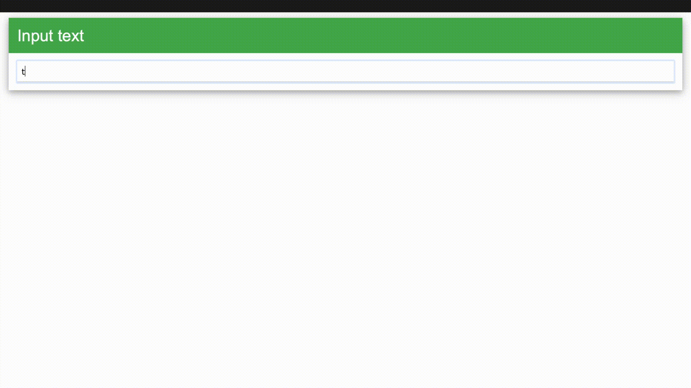
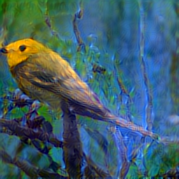
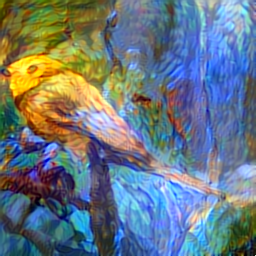

# Art GAN-erator
A project developed over three weeks at the Insight Fellowship that makes use of GANs + Style transfer to lower overhead costs of the ideation process for artists. My project aims to do so by generating novel images using text and then applying multiple styles to the image to quickly generate ideas.

## Features
- **Attentional GAN** : Implemented an attentional GAN which is capable of paying attention to the relevant words in a given text input and uses it to generate novel images
- **Neural Style Transfer** : Implemented a fast neural style transfer docker container which takes an input of a content image generated by the AttnGAN and a user given style image and applies the style. 
- **Flask and Docker** : Made use of Flask and Docker to deploy attnGAN and docker to run neural style transfer.
- **AWS and PyTorch** : Coded on a p2.xlarge AWS machine making use of PyTorch to modify the codebase.

## Dependencies
1. pipenv
2. python 2.7 (does not work with Python 3!)
3. A GPU!
4. [nvidia-docker](https://chunml.github.io/ChunML.github.io/project/Installing-NVIDIA-Docker-On-Ubuntu-16.04/)


## Setup
1. Clone repository.

2. Enter the repository folder through your terminal and run setup.sh which will install all the necessary files, models and data. This process can take some time as there are around 2GB of files required for this project. 

```
sh setup.sh
```

3. Create a virtual environment in root folder (i.e. art-gan-erator) to install all dependencies:
```
pipenv shell
pip install -r requirements.txt
```

## Usage

### To run the AttGAN flask application:

To run the web application use:

    flask run -h 0.0.0.0
    
Then navigate to the IP address http://0.0.0.0:5000/input or if using an AWS server (see running on AWS tips below) go to http://your-public-ip:5000/input in a browser.

### To run the style transfer:

Results of previous step are stored in the static folder in root directory. To style the image with a custom style, add an image titled as: "style.png" to static folder.

    sudo nvidia-docker run --rm -v ~/art-gan-erator:/images albarji/neural-style --content static/0_s_0_g2.png --style static/style.png --output output

Different strengths of the style can be applied by adding the option ss as follows:

    --ss 0.75 1 1.25
    
Each number will generate an image with given style strength. Smaller numbers reduce the amount of style applied to the generated image. Experimenting with these numbers I found 0.75-1 to be a good sweet spot for producing good bird-art images. Styled images are stored in the output folder.

## Results

The flask application:



The results are stored in static folder as "0_s_0_g2.png".

Some styled results:

With **ss = 1**



With **ss = 2**



## Troubleshooting
The repo requires python 2.7, the repo will fail if it isn't installed correctly.

To install pyenv and python: 
     
    brew install pyenv
    pyenv install 2.7.10
    pyenv global 2.7.10

If any errors when installing python: 

    xcode-select --install
    xcode-select --reset

Ensure that your IP is added in the security groups if you are using a AWS server to run this code or the application will not be accessible.

## Running on AWS tips

1. Add 'your-IP-address/32' to inbound rules in security groups in the AWS console (EC2 console) with SSH access to SSH into AWS
2. Also add 'your-IP-address/32' to inbound rules in security groups with TCP access in port 5000 
3. SSH into AWS using your credentials - I use the connect command on AWS terminal and copy paste the example instruction.
4. Run pipenv shell, ensure all dependencies are properly installed and the flask run command as detailed above
5. If everything is running properly then it should look like this when flask run command is run:


6. Finally navigate to 'your-public-ip:5000/input' which can be found in the AWS console under the instances tab.

## Future steps


1. Integrating a tf.js style transfer application with my web application to have this final result eliminating the need for current nvidia-docker style transfer.

2. Having a CPU only version of attnGAN to remove dependency on GPU completely from the application.

3. Developing a scalable application that can serve multiple simultatenous users. Future commercialization potential!

## Credits
These papers proved invaluable in understanding the problem space:

https://arxiv.org/abs/1508.06576

https://arxiv.org/abs/1711.10485

This work would not have been possible without the code bases from the following repos:

https://github.com/taoxugit/AttnGAN

https://github.com/jcjohnson/neural-style

https://github.com/albarji/neural-style-docker

https://github.com/reiinakano/arbitrary-image-stylization-tfjs

